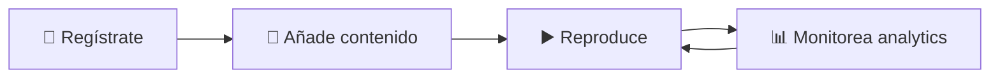

<div align="center">

# 🎵 Auralix

### *Reproductor multimedia minimalista con telemetría inteligente*

<p align="center">
  
  
  
  
  
</p>

<p align="center">
  <strong>Inspirado en Apple Music · Construido con tecnología web moderna</strong>
</p>

</div>

---

## 💡 Por qué Auralix

La mayoría de reproductores web usan controles nativos del navegador y no registran datos de uso. **Auralix es diferente**: cada interacción se captura, cada sesión se analiza, cada patrón se descubre.

**El nombre "Auralix"** combina **"Aura"** (el ambiente único que cada medio genera) y **"lix"** (sufijo que evoca fluidez y experiencia moderna) — representando la experiencia envolvente que buscamos crear.

<div align="center">

### ✨ Experiencia · 📊 Analytics · 🎯 Personalización

</div>

---

## 🚀 Características principales

<table>
<tr>
<td width="50%">

### 🎨 Diseño minimalista
Interfaz inspirada en **Apple Music** con glassmorphism, navegación por pestañas y controles intuitivos que se adaptan a tu tema preferido.

### 📤 Upload inteligente
Sistema de **drag & drop** con barra de progreso en tiempo real. Soporta MP3, MP4, WEBM, OGG, FLAC y mucho más.

### 📊 Telemetría completa
Cada acción queda registrada: **play, pause, seek, velocidad, volumen**. Todo con timestamp y posición exacta para análisis posterior.

</td>
<td width="50%">

### 📈 Analytics en vivo
Dashboard completo con **KPIs globales**, ranking de operadores más activos y tu historial personal de reproducciones.

### 🌓 Temas adaptativos
Modo **claro/oscuro** con persistencia en localStorage. La interfaz se adapta automáticamente a tu preferencia.

### ⌨️ Atajos de teclado
Control total sin ratón: `Space` play/pause · `←→` seek ±5s · `↑↓` volumen. Productividad al máximo.

</td>
</tr>
</table>

---

## 📦 Inicio rápido

```bash
# 1️⃣ Clonar el proyecto
git clone https://github.com/agusmadev/Auralix.git
cd Auralix

# 2️⃣ Crear entorno virtual
# Windows
python -m venv .venv
.venv\Scripts\Activate.ps1

# Linux/Mac
python3 -m venv .venv
source .venv/bin/activate

# 3️⃣ Instalar dependencias
pip install -r requirements.txt

# 4️⃣ Ejecutar la aplicación
python app.py
```

<div align="center">

🌐 Abre **http://localhost:5070** y empieza a reproducir

</div>

---

## 🎯 Cómo funciona



| Paso | Acción | Detalles |
|------|--------|----------|
| **1️⃣** | **Regístrate** | Ingresa tu nombre y DNI. Tu identidad queda vinculada a todas tus sesiones |
| **2️⃣** | **Añade contenido** | Arrastra archivos multimedia o pega URLs. Soporta múltiples formatos |
| **3️⃣** | **Reproduce** | Usa los controles custom: play/pause, seek, velocidad, volumen |
| **4️⃣** | **Monitorea** | Vista Analytics con estadísticas completas y tasa de completitud |

---

## 🏗️ Arquitectura

```
┌─────────────────────────────────────────────┐
│          🎨 Frontend (SPA)                  │
│  ┌───────────────────────────────────────┐  │
│  │  🎬 HTML5 <video> / <audio>          │  │
│  │  🎛️  Custom controls + navigation     │  │
│  │  📤 Drag & drop upload zone          │  │
│  │  📊 Real-time analytics dashboard    │  │
│  └───────────────┬───────────────────────┘  │
│                  │ fetch API / XHR           │
├──────────────────┼───────────────────────────┤
│          ⚙️  Backend (Flask)                │
│  ┌───────────────────────────────────────┐  │
│  │  🔌 REST API Endpoints               │  │
│  │  📁 File upload handler              │  │
│  │  🗄️  SQLite Database                 │  │
│  │     • operators                      │  │
│  │     • media_items                    │  │
│  │     • playback_sessions              │  │
│  │     • playback_events                │  │
│  └───────────────────────────────────────┘  │
└─────────────────────────────────────────────┘
```

> 💡 **SPA con comunicación asíncrona**: Toda la UI se gestiona con JavaScript vanilla, sin frameworks. Flask proporciona una API REST pura para todas las operaciones.

---

## 🔌 API Endpoints

<table>
<tr><th>Método</th><th>Endpoint</th><th>Descripción</th></tr>
<tr><td><code>POST</code></td><td><code>/api/operators/register</code></td><td>🆔 Registrar operador</td></tr>
<tr><td><code>GET</code></td><td><code>/api/media</code></td><td>📋 Listar medios</td></tr>
<tr><td><code>POST</code></td><td><code>/api/media</code></td><td>➕ Añadir medio por URL</td></tr>
<tr><td><code>POST</code></td><td><code>/api/upload</code></td><td>📤 Subir archivo local</td></tr>
<tr><td><code>POST</code></td><td><code>/api/sessions/start</code></td><td>▶️ Iniciar sesión de reproducción</td></tr>
<tr><td><code>POST</code></td><td><code>/api/sessions/event</code></td><td>📡 Registrar evento (play, pause, seek...)</td></tr>
<tr><td><code>POST</code></td><td><code>/api/sessions/end</code></td><td>⏹️ Finalizar sesión</td></tr>
<tr><td><code>GET</code></td><td><code>/api/operators/:id/history</code></td><td>📜 Historial de operador</td></tr>
<tr><td><code>GET</code></td><td><code>/api/leaderboard</code></td><td>🏆 Top 10 operadores</td></tr>
<tr><td><code>GET</code></td><td><code>/api/stats</code></td><td>📊 KPIs globales</td></tr>
<tr><td><code>GET</code></td><td><code>/api/health</code></td><td>💚 Health check</td></tr>
</table>

---

## 🛠️ Stack Tecnológico

<div align="center">

| Capa | Tecnología |
|:----:|:-----------|
| 🔧 **Backend** | Flask 3.x + SQLite 3 |
| 🎨 **Frontend** | HTML5 Media API + Vanilla JavaScript ES6+ |
| 💅 **Diseño** | CSS3 Custom Properties + Glassmorphism |
| 📤 **Upload** | XMLHttpRequest con progress tracking |
| 💾 **Persistencia** | localStorage para tema y sesión |

</div>

---

## 📁 Estructura del Proyecto

```
🎵 Auralix/
│
├── 🐍 app.py                           # Flask backend + SQLite + REST API
├── 📋 requirements.txt                 # flask>=3.0
├── 🗄️  auralix.sqlite3                 # Base de datos (auto-generada)
│
├── 📄 templates/
│   └── index.html                      # SPA principal con navegación por pestañas
│
├── 📦 static/
│   ├── app.js                          # Lógica frontend (navegación, player, telemetría)
│   ├── styles.css                      # Design system minimalista con glassmorphism
│   └── uploads/                        # 📁 Archivos multimedia subidos
│
├── 📝 Actividad_Auralix_53945291X.md
├── 📄 Plantilla_Examen_Auralix.md
└── 📖 README.md
```

---

## 🎓 Contexto Académico

> Proyecto desarrollado para el módulo **Programación Multimedia y Dispositivos Móviles (PMDM)** en **DAM2**

<div align="center">

| 📚 Campo | 📌 Detalle |
|:---------|:-----------|
| **Módulo** | PMDM — Programación Multimedia y Dispositivos Móviles |
| **Ciclo** | DAM2 — Desarrollo de Aplicaciones Multiplataforma |
| **Curso** | 2025/2026 |
| **Actividad** | 003 — Reproductor Multimedia Personalizado |

</div>

### ✅ Objetivos Cumplidos

- ✨ **HTML5 Media API** — Implementación completa de `<video>` y `<audio>`
- 📊 **Telemetría de eventos** — Registro exhaustivo de todas las interacciones
- 🗄️ **Persistencia con SQLite** — 4 tablas relacionales con integridad referencial
- 📤 **Upload de archivos** — Sistema de drag & drop con validación y progreso
- 📈 **Analytics en tiempo real** — KPIs, rankings y visualización de datos
- 🔌 **REST API completa** — 11 endpoints documentados y funcionales

---

<div align="center">

## 👨‍💻 Autor

**Agustín Morcillo**  
[@agusmadev](https://github.com/agusmadev) · GitHub

*DAM2 · Desarrollo de Aplicaciones Multiplataforma*  
*Curso 2025/2026*

---

### 💫 Tecnologías


---

*Construido con ❤️ usando HTML5 Media API + Flask + SQLite*

**[⬆️ Volver arriba](#-auralix)**

</div>
